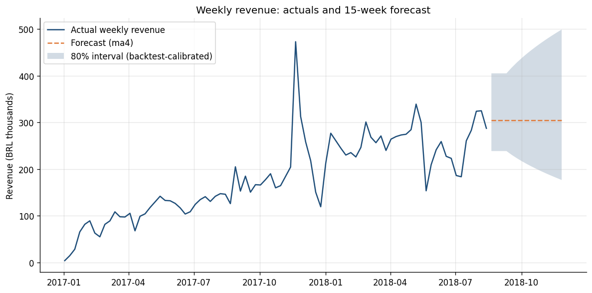

# Olist Revenue & Lifecycle Analytics

End-to-end analytics on a real Brazilian e-commerce marketplace (Olist, ~100k orders, 2016–2018) plus its seller-acquisition CRM data (8,000 marketing-qualified leads). The project covers **revenue forecasting and planning**, a **seller acquisition funnel**, **customer and seller retention/churn**, **KPI definitions for a BI dashboard**, and **data quality checks across nine source tables**.

**Stack:** Python · SQL · dbt (DuckDB locally, Snowflake-ready profile) · statsmodels · Power BI (DAX measures + star-schema exports)



---

## Key findings

**Revenue & planning**
- R$15.6M gross revenue across 97,024 orders in the analysis window. H1 2018 revenue was 2.8× H1 2017, and weekly revenue has been roughly flat at R$250–300k since early 2018.
- Four forecasting models were backtested over 10 rolling origins with a 4-week horizon. A 4-week moving average won with a **16.4% weekly WAPE**, beating damped Holt, a trend regression with holiday effects, and a naive baseline. Growth has plateaued, so trend models overshoot.
- The regression estimates Black Friday week at **2.27× normal revenue**. The monthly plan (`reports/revenue_plan_monthly.csv`) applies this uplift to November: base R$1.69M, P10–P90 range R$1.46M–R$2.03M.
- The sharp dip in the week of May 21, 2018 coincides with Brazil's nationwide truckers' strike, a real external shock rather than a data issue.

**Seller acquisition funnel** (6,311 mature leads)
- MQL → won: **10.0%**. Won → first sale: **49.2%**. Activated → sold in 3+ months: **50.6%**.
- **Half of signed sellers never make a sale**, making activation the biggest leak after lead qualification.
- Paid search wins at a similar rate to organic (11.5% vs 10.9%) but **activates at 59% vs 45%**, so paid-search sellers are more valuable once signed. Email converts worst (2.9% win rate).
- Median sales cycle is 14 days, but the P90 is 162 days, a long tail worth a separate nurture track.

**Retention & churn**
- Customers almost never return: **3.0% repeat rate**, and repeat customers generate only 5.7% of revenue. 30.5% of "second orders" happen the same day as the first (split checkouts), so true repurchase is even lower. Lifecycle leverage is in sellers, not buyers.
- **Seller monthly churn averages 25%** in 2018. Churn falls steeply with seller size: 69% of sellers with 1–2 lifetime orders are churned, vs 15% of sellers with 50+ orders.
- RFM segmentation shows 23% of customers are high-value one-timers who haven't returned in about a year, holding 37% of revenue. That's the natural win-back audience.

**Data quality** (full report: [`reports/data_quality_report.md`](reports/data_quality_report.md))
- The source extract **truncates after 2018-08-22**: daily orders fall from about 250 to 0. `dq_volume_anomalies` flags this automatically, and the analysis window ends 2018-08-19 so the drop isn't misread as a collapse in demand.
- 462 of 842 sellers signed in the CRM never appear in the marketplace seller table. This cross-system gap is the activation problem seen from the data side.
- 232 orders have payments exceeding item + freight value (installment interest and vouchers), so revenue is defined from order items, not payments.
- 166 orders show carrier pickup *before* purchase, indicating clock skew between the logistics and order systems.

---

## Architecture

```
data/raw/*.csv  ──►  scripts/load_raw.py  ──►  DuckDB  raw.*
                                                  │
                                         dbt build (50 models + tests)
                     ┌────────────────────────────┼─────────────────────────────┐
               staging.* (typed views)      marts.* (star schema)       data_quality.*
                                                  │                             │
                              src/forecast.py · funnel.py · retention.py   data_quality_report.py
                                                  │                             │
                                   reports/*.csv + reports/figures/*.png  ◄─────┘
                                                  │
                                src/export_powerbi.py ──► data/exports/*.csv ──► Power BI
```

**dbt models**

| Layer | Models |
|---|---|
| Staging | `stg_orders`, `stg_order_items`, `stg_order_payments`, `stg_customers`, `stg_sellers`, `stg_products`, `stg_leads`, `stg_closed_deals` |
| Marts | `fct_orders`, `fct_daily_revenue`, `fct_lead_funnel`, `fct_seller_monthly`, `dim_customers`, `dim_sellers` |
| Data quality | `dq_payment_reconciliation`, `dq_order_lifecycle_anomalies`, `dq_orphan_keys`, `dq_possible_duplicate_orders`, `dq_volume_anomalies`, `dq_summary` |

Tests include uniqueness and not-null checks on every grain, accepted values, relationships (CRM deals → leads, items → orders), and custom tests: funnel stages must be monotonic, the gap-filled daily series must reconcile to the order fact, and the payment-reconciliation failure rate must stay under 2%.

Business rules are dbt variables (`dbt_project.yml`): non-revenue statuses, the 60-day seller churn threshold, the payment tolerance, and the analysis end date.

---

## How to run

```bash
git clone https://github.com/msamad08/olist-revenue-lifecycle-analytics.git
cd olist-revenue-lifecycle-analytics
python -m venv .venv && source .venv/bin/activate
make setup      # install requirements
make data       # download both Olist datasets via the Kaggle CLI (or place CSVs in data/raw/)
make all        # load → dbt build → analyses → Power BI exports
```

Required files in `data/raw/`: the nine CSVs from [Brazilian E-Commerce Public Dataset by Olist](https://www.kaggle.com/datasets/olistbr/brazilian-ecommerce) (orders, order_items, order_payments, customers, sellers, products, category translation) and [Marketing Funnel by Olist](https://www.kaggle.com/datasets/olistbr/marketing-funnel-olist) (marketing_qualified_leads, closed_deals).

**Running on Snowflake:** load the CSVs to a `RAW` schema, set the `SNOWFLAKE_*` environment variables, and run `dbt build --profiles-dir . --target snowflake`. Models use DuckDB-compatible SQL; the few dialect-specific functions (`arg_max`, `generate_series`, `date_diff`) have direct Snowflake equivalents (`max_by`, a `generator` table, `datediff`).

**Power BI:** import `data/exports/*.csv`, create the relationships listed in `src/export_powerbi.py`, add the measures from [`powerbi/dax_measures.md`](powerbi/dax_measures.md), and build the pages in [`powerbi/dashboard_spec.md`](powerbi/dashboard_spec.md).

---

## Repository layout

```
├── dbt/                    dbt project (models, tests, macros, profiles)
├── docs/metric_definitions.md   single source of truth for every KPI
├── powerbi/                DAX measures and dashboard spec
├── reports/                analysis outputs (CSV) and figures
├── scripts/                data download and raw load
├── src/                    forecasting, funnel, retention, DQ report, Power BI export
├── Makefile
└── requirements.txt
```

## Outputs

| Area | Files |
|---|---|
| Forecasting | `forecast_backtest.csv`, `revenue_forecast_weekly.csv`, `revenue_plan_monthly.csv`, `revenue_forecast.png`, `forecast_backtest.png` |
| Funnel | `funnel_overall.csv`, `funnel_by_origin.csv`, `funnel_by_segment.csv`, `funnel_timing.csv`, 3 figures |
| Retention | `customer_cohort_retention_pct.csv`, `customer_retention_summary.csv`, `rfm_segments.csv`, `seller_monthly_churn.csv`, `seller_cohort_retention_pct.csv`, `seller_churn_by_size.csv`, 3 figures |
| Data quality | `data_quality_report.md`, `data_quality_findings.csv`, `dq_volume_truncation.png` |

## Limitations

- The data ends in August 2018, so the forecast is a backtested method demonstration, not a live prediction.
- The public seller table only contains sellers with orders in the sample, so "signed but never in the seller table" can't separate "never listed" from "listed but never sold."
- 85 weeks of history include only one Black Friday, so the holiday multiplier is estimated from a single event.
- Customer cohorts are small in later months, so month-12 retention cells rest on few customers.

## Data & license

Data: Olist, [CC BY-NC-SA 4.0](https://creativecommons.org/licenses/by-nc-sa/4.0/). Raw data is not committed to this repository. Code: MIT.
